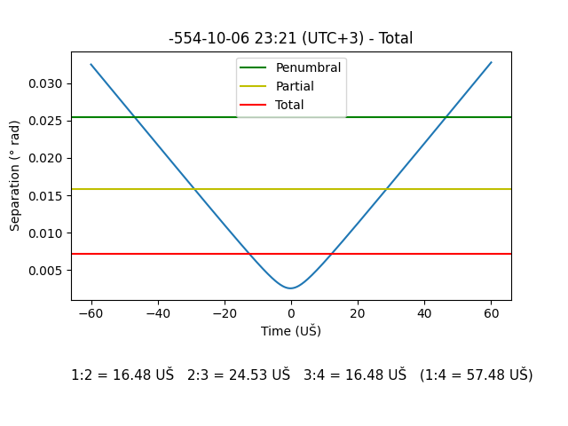
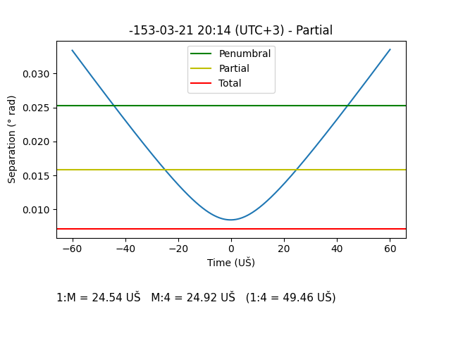

Introduction to the Babylonian Astronomical Texts
=================================================

If you are not familiar with ancient Babylonian Astronomy I recommend
reading:

-   Teije de Jong’s [*Babylonian
    Astronomy*](https://www.astro.ru.nl/~fverbunt/iac2011/BabAstr.pdf)
    lecture slides from IAC2011 *History of Astronomy* (Radboud,
    Utrecht, and Amsterdam University) \[1\].
-   The Introduction (pages 11-38) of *Astronomical Diaries and Related
    Texts Vol. 1* \[2\].
-   Pages 126-139 of *Translating Babylonian Astronomical Diaries and
    Procedure Texts* \[3\].

Calendar
--------

> The Babylonians used a luni-solar calendar. The day began at sunset,
> and each month began on the night when the lunar cresent was first
> visible. There were twelve months in most years, each month lasting
> for 29 or 30 days. To regulate the seasons, an intercalary month was
> inserted when necessary. \[4, p. 338\]

### Lunar Year

> The beginning of the year, day 1 of Nisannu (month I), always fell
> within about 30 days of the vernal equinox \[3, p. 131\]

The year could either have 12 or 13 months depending on if there was an
intercalary month. The intercalary month could be either a second Ulūlu
(VI₂) or a second Addaru (XII₂).

From the reign of Nabopolassar onwards, I am using the intercalary
months as documented by Parker and Dubberstein \[5, p. 4\].

However prior to Nabopolassar the arrangement of intercalary months is
not fully complete, but I am using this list of confirmed intercalary
months \[6, p. 67\]:

-   Shamash-shum-ukin Year 14, Addaru II: BM 29496, YBC 11309
-   Kandalanu Year 5, Ululu II: Clay BE 8/1, No.3,
    [BM76738](./bm76738_76813.md#translation) Obv. 10
-   Kandalanu Year 8, Ululu II:
    [BM76738](./bm76738_76813.md#translation) Obv. 15
-   Kandalanu Year 10, Addaru II: BM 54213,
    [BM76738](./bm76738_76813.md#translation) Rev. 20
-   Kandalanu Year 19, Addaru II: YBC 11481, 11300, 11476, NBC 6144

### Lunar Month

> Day 1 of the new month was declared at the first appearance of the
> lunar crescent after sunset… The only attested month lengths are 29
> days and 30 days, because day 1 was declared no later than the sunset
> at the end of day 30, irrespective of whether the crescent was then
> observed or not. \[3, p. 131\]

In order to compute the start of the month I am using the following
lunar visibility parameter:

> Our calculation shows that 7.5° (±0.25°) is the lowest naked eye
> visibility limit. \[7, p. 58\]

Angular Separations
-------------------

The diaries describe the angular separations; the angle between two
sightlines from the observer on Earth to two different celestial bodies
in the sky. These are measured in terms of “cubits” and “fingers”, where
there are 24 fingers in a cubit. In order to convert to degrees:

> Our results for the angular equivalent of the finger and cubit in the
> Neo-Babylonian period are respectively 0.092 and 2.2 deg \[8, p. 212\]

The diaries sometimes describe bodies as appearing within a “halo”, this
is a ring around the moon or sun with a 22° (or 10 cubit) radius. Haloes
can also exist as a 46° ring, but they are not found in the diaries:

> The larger type of halo called supūru is not so far attested in
> diaries. \[2, p. 33\]

### Constellations

Where the tablets describe a body as being within a constellation, I
will approximate that position by drawing an appropriate radius around a
relatively central star within that constellation. It is only possible
to take an approximate approach anyway given that the boundaries for
ancient constellations have not been strictly defined.

Planetary Visibilty
-------------------

Inner Planet (Mercury, Venus) synodic phenomena:

<table>
<thead>
<tr class="header">
<th>Translation</th>
<th>Name</th>
<th>Acronym</th>
</tr>
</thead>
<tbody>
<tr class="odd">
<td>to appear in the west</td>
<td>evening first</td>
<td>EF</td>
</tr>
<tr class="even">
<td>to be stationary in the west</td>
<td>evening station</td>
<td>ES</td>
</tr>
<tr class="odd">
<td>to set in the west</td>
<td>evening last</td>
<td>EL</td>
</tr>
<tr class="even">
<td>to appear in the east</td>
<td>morning first</td>
<td>MF</td>
</tr>
<tr class="odd">
<td>to be stationary in the east</td>
<td>morning station</td>
<td>MS</td>
</tr>
<tr class="even">
<td>to set in the east</td>
<td>morning last</td>
<td>ML</td>
</tr>
</tbody>
</table>

Outer Planet (Mars, Jupiter, Saturn) synodic phenomena:

<table>
<thead>
<tr class="header">
<th>Translation</th>
<th>Name</th>
<th>Acronym</th>
</tr>
</thead>
<tbody>
<tr class="odd">
<td>to appear</td>
<td>first appearance</td>
<td>FA</td>
</tr>
<tr class="even">
<td>to be stationary at the first</td>
<td>first station</td>
<td>S1</td>
</tr>
<tr class="odd">
<td>to rise to daylight</td>
<td>acronychal rising</td>
<td>AR</td>
</tr>
<tr class="even">
<td>to be stationary at the second</td>
<td>second station</td>
<td>S2</td>
</tr>
<tr class="odd">
<td>to set</td>
<td>last appearance</td>
<td>LA</td>
</tr>
</tbody>
</table>

Computing the synodic phenomena requires setting Arcus Visionis
parameters:

> the minimum angular distance between the star/planet and the Sun
> measured perpendicular to the horizon for the star/planet to be
> visible \[1, p. 38\]

I am using the default fixed arcus visionis parameters from Alcyone
Planetary, Stellar and Lunar Visibility \[9\] (see `src/constants.py`).

Lunar Six Intervals
-------------------

<table>
<thead>
<tr class="header">
<th>Lunar Six</th>
<th>From</th>
<th>To</th>
<th>Taken Near</th>
</tr>
</thead>
<tbody>
<tr class="odd">
<td>NA₁</td>
<td><strong>sunset</strong></td>
<td>first visible <strong>moonset</strong> after sunset</td>
<td>New Moon</td>
</tr>
<tr class="even">
<td>ŠU₂</td>
<td>last <strong>moonset</strong> before sunrise</td>
<td><strong>sunrise</strong></td>
<td>Full Moon</td>
</tr>
<tr class="odd">
<td>NA</td>
<td><strong>sunrise</strong></td>
<td>first <strong>moonset</strong> after sunrise</td>
<td>Full Moon</td>
</tr>
<tr class="even">
<td>ME</td>
<td>last <strong>moonrise</strong> before sunset</td>
<td><strong>sunset</strong></td>
<td>Full Moon</td>
</tr>
<tr class="odd">
<td>GI₆</td>
<td><strong>sunset</strong></td>
<td>first <strong>moonrise</strong> after sunset</td>
<td>Full Moon</td>
</tr>
<tr class="even">
<td>KUR</td>
<td>last visible <strong>moonrise</strong> before sunrise</td>
<td><strong>sunrise</strong></td>
<td>New Moon</td>
</tr>
</tbody>
</table>

Times are measured in UŠ - “time degrees”. There are 360 UŠ in a day, so
1 UŠ = 4 minutes, 1 bēru = 30 UŠ \[10\] \[2, p. 16\]

> The two pairs of visibility phenomena around full moon, the first
> being ME and GE₆ and the other consisting of ŠÚ and NA, are frequently
> designated as the Lunar Four. \[11, p. 7\]

Eclipses
--------

> Observations of eclipses by the Babylonian astronomers usually contain
> the time of the eclipse measured relative to sunset or sunrise, the
> approximate entrance angle of the shadow, and an estimate of the
> eclipse magnitude. In many reports the duration of the individual
> phases of the eclipse are also given. \[12, p. 120\]

> It is characteristic for the record of the observation to end with a
> time. This may be understood as referring to the time of first
> contact. \[12, p. 120\]

> The eclipse records also contain descriptions of lunar eclipses that
> proved invisible at Babylon. These descriptions must then be
> predictions rather than observations. Usually it is possible to
> distinguish a predicted eclipse from an observation by the terminology
> used. \[12, p. 121\]

Some reports include measurements of the eclipse phases, including the
time to maximal phase (onset), duration of maximal phase (totality), and
time from the end of maximal phase to the end of the eclipse (clearing),
or the total length the eclipse which is the sum of all three phases.
\[2, p. 24\]

In the case of a total lunar eclipse, the onset is the time from when
the moon becomes partially eclipsed (1:2) to the start of the full
eclipse, the maximal phase is the time in which it is fully eclipsed
(2:3), and the clearing is the time until it is no longer partially
eclipsed (3:4) \[4, p. 341\]: 

In the case of partial eclipses it is less straightforward, I can
measure the time from the start of the partial eclipse until it becomes
maximal (i.e. nearest separation of the moon and the shadow) (1:M), and
the time from then to the end of the eclipse (M:4). But because there is
a continuous curve, it is difficult to define a maximal phase
“duration”: 

Therefore in the case of partial eclipses I am only considering the
total eclipse duration.

Translations
------------

The general conventions used for most of the translations \[2, p. 37\]:

-   Square brackets `[]` denote missing/reconstructed text
-   Half brackets `⌜⌝` denote text damaged in some other way
-   A question mark indicates doubts about the reading of a sign

As a general rule I will not rely on reconstructed text for use in
analysing the observations; I will treat those sections as if they were
missing. There are some exceptions to this, such as where it is possible
to deduce information about the missing text from its surroundings, for
example:

-   Where a year/month/day number is missing or damaged I will assume
    that if the text is in order then the missing number will fit within
    the range of adjacent lines
-   [BM76738](./bm76738_76813.md) follows a consistent pattern where
    every other line is the last/first appearance, and every two lines
    spans a year.

References
----------

\[1\] T. de Jong, “Babylonian Astronomy,” May 2011, \[Online\].
Available: <https://www.astro.ru.nl/~fverbunt/iac2011/BabAstr.pdf>.

\[2\] H. Hunger and A. J. Sachs, *Astronomical diaries and related texts
from Babylonia. Vol. 1, Diaries from 652 B.C. to 262 B.C. : Plates*.
Verlag der Österreichischen Akademie der Wissenschaften, 1988.

\[3\] M. Ossendrijver, “Translating Babylonian Astronomical Diaries and
Procedure Texts,” *Translating Writings of Early Scholars in the Ancient
Near East, Egypt, Greece and Rome: Methodological Aspects with
Examples*, vol. 344, p. 125, 2016, \[Online\]. Available:
<https://www.degruyter.com/view/book/9783110448818/10.1515/9783110448818-005.xml>.

\[4\] J. Steele, F. Stephenson, and L. Morrison, “The accuracy of
eclipse times measured by the Babylonians,” *Journal for the History of
Astronomy*, vol. 28, no. 4, pp. 337–345, 1997, \[Online\]. Available:
<http://adsabs.harvard.edu/full/1997JHA....28..337S>.

\[5\] W. H. Dubberstein and R. A. Parker, *Babylonian Chronology 626
B.C.-A.D. 75*. Brown University Press, 1956, \[Online\]. Available:
<https://webspace.science.uu.nl/~gent0113/babylon/downloads/babylonian_chronology_pd_1971.pdf>.

\[6\] J. A. Brinkman and D. A. Kennedy, “Documentary Evidence for the
Economic Base of Early Neo-Babylonian Society: A Survey of Dated
Babylonian Economic Texts, 721-626 B.C.” *Journal of Cuneiform Studies*,
vol. 35, no. 1, pp. 1–90, 1983, \[Online\]. Available:
<http://www.jstor.org/stable/3515942>.

\[7\] A. H. Sultan, “First visibility of the lunar crescent: beyond
Danjon’s limit,” *The Observatory*, vol. 127, pp. 53–59, 2007,
\[Online\]. Available:
<http://adsabs.harvard.edu/full/2007Obs...127...53S>.

\[8\] L. J. Fatoohi and F. R. Stephenson, “Angular measurements in
Babylonian astronomy,” *Archiv für Orientforschung*, pp. 210–214, 1997,
\[Online\]. Available: <https://www.jstor.org/stable/41670130>.

\[9\] Alcyone, “Planetary, Stellar and Lunar Visibility.” \[Online\].
Available:
<http://www.alcyone.de/planetary_lunar_and_stellar_visibility.html>.

\[10\] F. R. Stephenson and L. J. Fatoohi, “The Babylonian unit of
time,” *Journal for the history of astronomy*, vol. 25, no. 2, pp.
99–110, 1994, \[Online\]. Available:
<http://adsabs.harvard.edu/full/1994JHA....25...99S>.

\[11\] J. P. Britton, “Remarks on Strassmaier Cambyses 400,” *From the
Banks of the Euphrates: Studies in Honor of Alice Louise Slotsky*, pp.
7–33, 2008.

\[12\] J. M. Steele and F. R. Stephenson, “Lunar eclipse times predicted
by the Babylonians,” *Journal for the History of Astronomy*, vol. 28,
no. 2, pp. 119–131, 1997, \[Online\]. Available:
<https://journals.sagepub.com/doi/10.1177/002182869702800203>.
